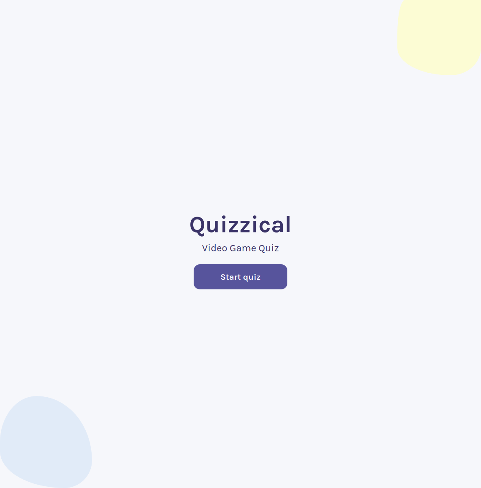
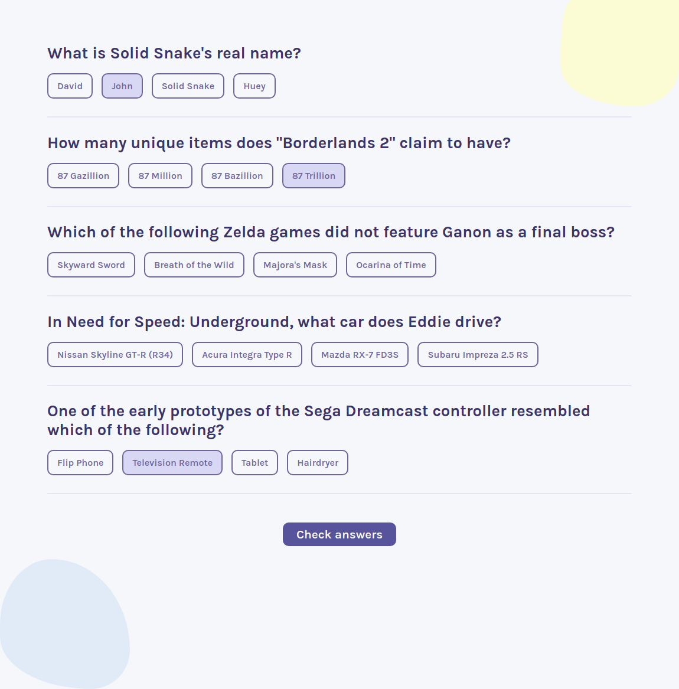
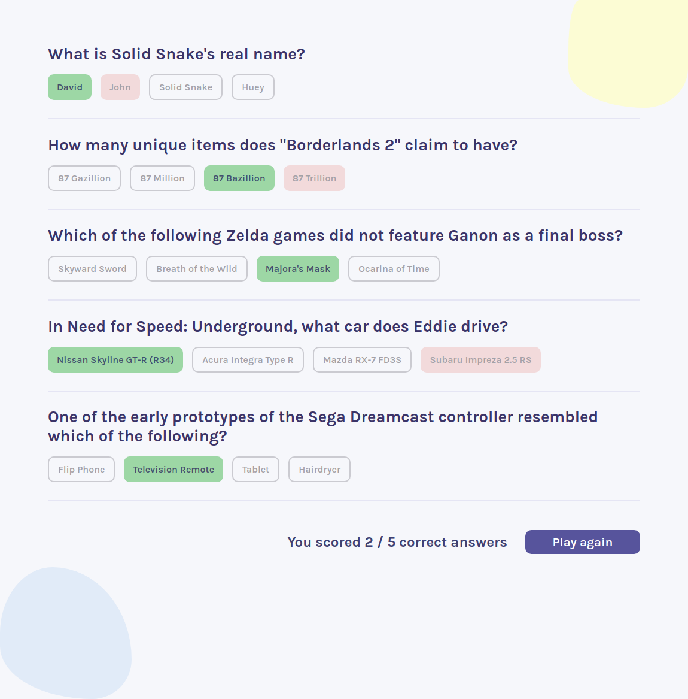
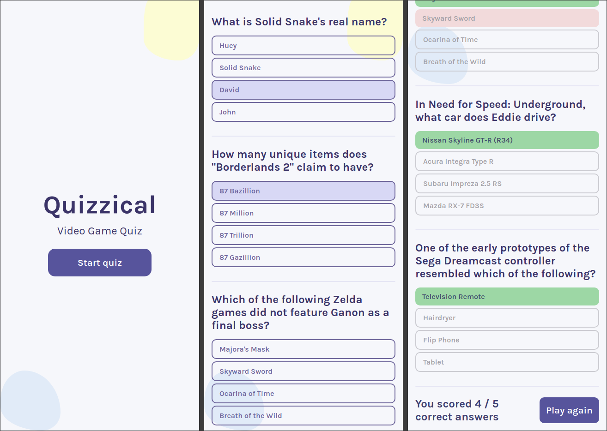

# Scrimba React Project #8: Quizzical

The goal of this project was to create a quizzical trivia website using React and Open Trivia DB API. Questions are about video games.

I started and finished this project in June 2023.

## Assignment

[Scrimba - Learn React - #8 Solo Project: Quizzical](https://scrimba.com/learn/learnreact)

## Technology

- React
- JavaScript
- Vite
- CSS

## Key Concepts

- State: useState, changing state, updating state objects and arrays
- useEffect: side effects, syntax, dependencies array, async functions
- Forms in React: radio inputs
- Event listeners in React
- Conditional rendering
- Fetching data from API

## Features

- User gets a score after selecting the answers.
- User can keep playing and get more questions.

## Links

[Live Demo](https://bn7631-scrimba-quizzical.pages.dev)

## Screenshots

### Desktop







### Mobile



## Deployment

```bash
# clone repo
git clone https://github.com/BrightNeon7631/scrimba-quizzical.git

# install project dependencies
npm install

# run vite dev server
npm run dev

# create a production build
npm run build
```
